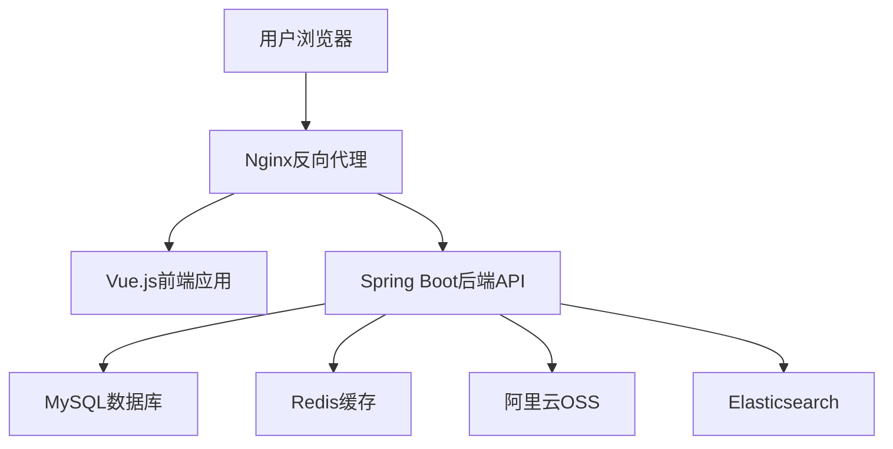
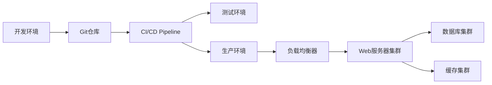

# 个人博客系统功能规划报告

## 📋 项目信息

| 项目名称 | 个人博客系统  |
| -------- | ------------- |
| 项目类型 | 全栈 Web 应用 |
| 开发模式 | 前后端分离    |
| 预计工期 | 8-12 周       |
| 文档版本 | v1.0          |

## 🎯 功能需求分析

### 1. 核心功能模块

#### 1.1 用户认证模块

**功能描述**: 管理员登录认证系统

- **登录功能**: 用户名/邮箱 + 密码登录
- **JWT 令牌**: 无状态身份验证
- **记住登录**: 本地存储认证信息
- **登录安全**: 验证码、登录失败锁定

**技术实现**:

```java
// 后端 - Spring Security + JWT
@RestController
@RequestMapping("/api/auth")
public class AuthController {
    @PostMapping("/login")
    public ResponseEntity<LoginResponse> login(@RequestBody LoginRequest request);

    @PostMapping("/logout")
    public ResponseEntity<Void> logout();

    @PostMapping("/refresh")
    public ResponseEntity<TokenResponse> refreshToken(@RequestBody RefreshRequest request);
}
```

#### 1.2 文章管理模块

**功能描述**: 博客文章的完整生命周期管理

**前台功能**:

- 文章列表展示 (分页/无限滚动)
- 文章详情查看
- 文章搜索 (标题/内容/标签)
- 文章分类筛选
- 文章标签筛选
- 相关文章推荐

**后台功能**:

- 文章创建/编辑 (Markdown 编辑器)
- 文章状态管理 (草稿/发布/下线)
- 文章 SEO 设置 (标题/描述/关键词)
- 文章置顶设置
- 文章访问统计

**数据模型**:

```sql
-- 文章表
CREATE TABLE tb_article (
    id BIGINT PRIMARY KEY AUTO_INCREMENT COMMENT '文章ID',
    title VARCHAR(255) NOT NULL COMMENT '文章标题',
    summary TEXT COMMENT '文章摘要',
    content LONGTEXT NOT NULL COMMENT '文章内容',
    content_html LONGTEXT COMMENT '文章HTML内容',
    cover_image VARCHAR(500) COMMENT '封面图片',
    category_id BIGINT COMMENT '分类ID',
    tags VARCHAR(500) COMMENT '标签列表',
    status TINYINT DEFAULT 1 COMMENT '状态:0-草稿,1-发布,2-下线',
    is_top TINYINT DEFAULT 0 COMMENT '是否置顶',
    view_count INT DEFAULT 0 COMMENT '访问量',
    like_count INT DEFAULT 0 COMMENT '点赞数',
    comment_count INT DEFAULT 0 COMMENT '评论数',
    seo_title VARCHAR(255) COMMENT 'SEO标题',
    seo_description VARCHAR(500) COMMENT 'SEO描述',
    seo_keywords VARCHAR(300) COMMENT 'SEO关键词',
    create_time DATETIME DEFAULT CURRENT_TIMESTAMP COMMENT '创建时间',
    update_time DATETIME DEFAULT CURRENT_TIMESTAMP ON UPDATE CURRENT_TIMESTAMP COMMENT '更新时间',

    INDEX idx_category_id (category_id),
    INDEX idx_status (status),
    INDEX idx_create_time (create_time),
    INDEX idx_is_top (is_top)
) ENGINE=InnoDB DEFAULT CHARSET=utf8mb4 COMMENT='文章表';
```

#### 1.3 分类标签模块

**功能描述**: 文章内容的分类和标签管理

**分类管理**:

- 无限级分类结构
- 分类图标设置
- 分类描述
- 分类文章统计

**标签管理**:

- 标签创建/编辑
- 标签热度统计
- 标签云展示
- 标签关联文章

**数据模型**:

```sql
-- 分类表
CREATE TABLE tb_category (
    id BIGINT PRIMARY KEY AUTO_INCREMENT COMMENT '分类ID',
    name VARCHAR(100) NOT NULL COMMENT '分类名称',
    slug VARCHAR(100) UNIQUE COMMENT '分类别名',
    description TEXT COMMENT '分类描述',
    icon VARCHAR(100) COMMENT '分类图标',
    parent_id BIGINT DEFAULT 0 COMMENT '父分类ID',
    sort_order INT DEFAULT 0 COMMENT '排序',
    article_count INT DEFAULT 0 COMMENT '文章数量',
    status TINYINT DEFAULT 1 COMMENT '状态:0-禁用,1-启用',
    create_time DATETIME DEFAULT CURRENT_TIMESTAMP,
    update_time DATETIME DEFAULT CURRENT_TIMESTAMP ON UPDATE CURRENT_TIMESTAMP
) ENGINE=InnoDB DEFAULT CHARSET=utf8mb4 COMMENT='分类表';

-- 标签表
CREATE TABLE tb_tag (
    id BIGINT PRIMARY KEY AUTO_INCREMENT COMMENT '标签ID',
    name VARCHAR(50) NOT NULL UNIQUE COMMENT '标签名称',
    color VARCHAR(20) COMMENT '标签颜色',
    description VARCHAR(200) COMMENT '标签描述',
    article_count INT DEFAULT 0 COMMENT '文章数量',
    create_time DATETIME DEFAULT CURRENT_TIMESTAMP
) ENGINE=InnoDB DEFAULT CHARSET=utf8mb4 COMMENT='标签表';

-- 文章标签关联表
CREATE TABLE tb_article_tag (
    id BIGINT PRIMARY KEY AUTO_INCREMENT,
    article_id BIGINT NOT NULL COMMENT '文章ID',
    tag_id BIGINT NOT NULL COMMENT '标签ID',
    create_time DATETIME DEFAULT CURRENT_TIMESTAMP,

    UNIQUE KEY uk_article_tag (article_id, tag_id),
    INDEX idx_article_id (article_id),
    INDEX idx_tag_id (tag_id)
) ENGINE=InnoDB DEFAULT CHARSET=utf8mb4 COMMENT='文章标签关联表';
```

#### 1.4 评论系统模块

**功能描述**: 文章评论和互动功能

**评论功能**:

- 游客评论 (昵称+邮箱)
- 评论回复 (多级回复)
- 评论审核机制
- 评论点赞
- 评论举报

**管理功能**:

- 评论审核管理
- 评论删除
- 评论统计
- 垃圾评论过滤

**数据模型**:

```sql
-- 评论表
CREATE TABLE tb_comment (
    id BIGINT PRIMARY KEY AUTO_INCREMENT COMMENT '评论ID',
    article_id BIGINT NOT NULL COMMENT '文章ID',
    parent_id BIGINT DEFAULT 0 COMMENT '父评论ID',
    author_name VARCHAR(50) NOT NULL COMMENT '评论者姓名',
    author_email VARCHAR(100) NOT NULL COMMENT '评论者邮箱',
    author_website VARCHAR(200) COMMENT '评论者网站',
    author_ip VARCHAR(50) COMMENT '评论者IP',
    content TEXT NOT NULL COMMENT '评论内容',
    like_count INT DEFAULT 0 COMMENT '点赞数',
    status TINYINT DEFAULT 0 COMMENT '状态:0-待审核,1-已通过,2-已拒绝',
    create_time DATETIME DEFAULT CURRENT_TIMESTAMP,

    INDEX idx_article_id (article_id),
    INDEX idx_parent_id (parent_id),
    INDEX idx_status (status),
    INDEX idx_create_time (create_time)
) ENGINE=InnoDB DEFAULT CHARSET=utf8mb4 COMMENT='评论表';
```

#### 1.5 文件管理模块

**功能描述**: 图片和文件的上传管理

**上传功能**:

- 图片上传 (支持拖拽)
- 文件类型限制
- 文件大小限制
- 图片压缩优化
- 云存储集成 (阿里云 OSS)

**管理功能**:

- 文件列表查看
- 文件删除
- 存储空间统计
- 上传记录

#### 1.6 系统配置模块

**功能描述**: 网站全局配置管理

**网站设置**:

- 网站基本信息 (标题/描述/关键词)
- 网站 Logo/Favicon
- 联系方式
- 社交媒体链接

**个人信息**:

- 个人简介
- 技能标签
- 工作经历
- 项目经验

### 2. 高级功能模块

#### 2.1 搜索功能

**技术方案**:

- 基础搜索: MySQL 全文索引
- 高级搜索: Elasticsearch (可选)
- 搜索建议
- 搜索历史
- 热门搜索

#### 2.2 统计分析

**统计指标**:

- 文章访问统计
- 用户访问统计
- 搜索关键词统计
- 评论统计
- 热门内容排行

**技术实现**:

- Google Analytics 集成
- 自定义统计脚本
- 数据可视化图表

#### 2.3 SEO 优化

**SEO 功能**:

- 自动生成 sitemap.xml
- robots.txt 管理
- Meta 标签优化
- 结构化数据
- 页面速度优化

## 🏗️ 技术架构设计

### 1. 总体架构



### 2. 前端技术栈

| 技术         | 版本 | 用途        |
| ------------ | ---- | ----------- |
| Vue.js       | 3.x  | 前端框架    |
| TypeScript   | 5.x  | 类型系统    |
| Vite         | 6.x  | 构建工具    |
| Vue Router   | 4.x  | 路由管理    |
| Pinia        | 2.x  | 状态管理    |
| Element Plus | 2.x  | UI 组件库   |
| Tailwind CSS | 3.x  | 样式框架    |
| Axios        | 1.x  | HTTP 客户端 |

### 3. 后端技术栈

| 技术            | 版本 | 用途       |
| --------------- | ---- | ---------- |
| Spring Boot     | 2.6+ | 应用框架   |
| Spring Security | 5.x  | 安全框架   |
| MyBatis Plus    | 3.x  | ORM 框架   |
| MySQL           | 8.0+ | 主数据库   |
| Redis           | 6.x  | 缓存数据库 |
| JWT             | -    | 身份认证   |
| Validation      | -    | 参数校验   |

### 4. 部署架构



## 📅 开发计划

### 第一阶段: 基础功能开发 (4 周)

**Week 1: 项目搭建**

- [x] 前后端项目初始化
- [ ] 数据库设计和创建
- [ ] 基础框架搭建
- [ ] 开发环境配置

**Week 2: 用户认证**

- [ ] 后端认证接口开发
- [ ] 前端登录页面
- [ ] JWT 集成
- [ ] 权限拦截器

**Week 3: 文章管理**

- [ ] 文章 CRUD 接口
- [ ] 文章列表页面
- [ ] 文章详情页面
- [ ] 分页功能

**Week 4: 基础 UI**

- [ ] 首页布局
- [ ] 导航组件
- [ ] 响应式适配
- [ ] 基础样式

### 第二阶段: 核心功能完善 (3 周)

**Week 5: 分类标签**

- [ ] 分类管理功能
- [ ] 标签管理功能
- [ ] 分类页面
- [ ] 标签云组件

**Week 6: 评论系统**

- [ ] 评论接口开发
- [ ] 评论组件
- [ ] 评论审核
- [ ] 多级回复

**Week 7: 文件管理**

- [ ] 文件上传接口
- [ ] 图片上传组件
- [ ] 云存储集成
- [ ] 文件管理页面

### 第三阶段: 高级功能 (3 周)

**Week 8: 搜索功能**

- [ ] 搜索接口
- [ ] 搜索页面
- [ ] 搜索建议
- [ ] 搜索统计

**Week 9: 统计分析**

- [ ] 访问统计
- [ ] 数据图表
- [ ] 后台仪表板
- [ ] 性能监控

**Week 10: 优化部署**

- [ ] SEO 优化
- [ ] 性能优化
- [ ] 测试完善
- [ ] 部署上线

### 第四阶段: 测试优化 (2 周)

**Week 11: 功能测试**

- [ ] 单元测试
- [ ] 集成测试
- [ ] 用户体验测试
- [ ] 性能测试

**Week 12: 上线维护**

- [ ] 生产环境部署
- [ ] 监控告警配置
- [ ] 文档完善
- [ ] 用户反馈收集

## 📊 API 接口设计

### 1. 认证接口

```yaml
# 用户登录
POST /api/auth/login
Content-Type: application/json

{
  "username": "admin",
  "password": "password",
  "captcha": "abc123"
}

Response:
{
  "code": 200,
  "message": "登录成功",
  "data": {
    "token": "eyJhbGciOiJIUzI1NiJ9...",
    "refreshToken": "eyJhbGciOiJIUzI1NiJ9...",
    "expiresIn": 7200,
    "userInfo": {
      "id": 1,
      "username": "admin",
      "nickname": "管理员",
      "avatar": "https://..."
    }
  }
}
```

### 2. 文章接口

```yaml
# 获取文章列表
GET /api/articles?page=1&size=10&category=&tag=&keyword=

Response:
{
  "code": 200,
  "message": "success",
  "data": {
    "total": 100,
    "pages": 10,
    "current": 1,
    "size": 10,
    "records": [
      {
        "id": 1,
        "title": "文章标题",
        "summary": "文章摘要",
        "coverImage": "封面图片",
        "category": {
          "id": 1,
          "name": "技术分享"
        },
        "tags": ["Vue", "JavaScript"],
        "viewCount": 1000,
        "commentCount": 10,
        "createTime": "2024-01-01 12:00:00"
      }
    ]
  }
}

# 获取文章详情
GET /api/articles/{id}

# 创建文章
POST /api/articles
Authorization: Bearer {token}

{
  "title": "文章标题",
  "summary": "文章摘要",
  "content": "文章内容(Markdown)",
  "coverImage": "封面图片URL",
  "categoryId": 1,
  "tags": ["Vue", "JavaScript"],
  "status": 1,
  "isTop": false,
  "seoTitle": "SEO标题",
  "seoDescription": "SEO描述",
  "seoKeywords": "SEO关键词"
}
```

### 3. 评论接口

```yaml
# 获取文章评论
GET /api/comments?articleId=1&page=1&size=10

# 添加评论
POST /api/comments

{
  "articleId": 1,
  "parentId": 0,
  "authorName": "评论者",
  "authorEmail": "email@example.com",
  "authorWebsite": "https://example.com",
  "content": "评论内容"
}
```

## 🧪 测试计划

### 1. 单元测试

- **覆盖率目标**: ≥ 80%
- **测试工具**: JUnit 5 + Mockito (后端), Vitest (前端)
- **测试内容**:
  - Service 层业务逻辑
  - Utils 工具类
  - 组件单元测试

### 2. 集成测试

- **测试工具**: TestContainers + H2Database
- **测试内容**:
  - API 接口测试
  - 数据库操作测试
  - 缓存功能测试

### 3. 端到端测试

- **测试工具**: Cypress / Playwright
- **测试场景**:
  - 用户登录流程
  - 文章发布流程
  - 评论功能测试

### 4. 性能测试

- **测试工具**: JMeter / Artillery
- **性能指标**:
  - 接口响应时间 < 500ms
  - 并发用户数 ≥ 1000
  - 系统吞吐量 ≥ 1000 TPS

## 🚀 部署方案

### 1. 开发环境

```yaml
# docker-compose.dev.yml
version: "3.8"
services:
  mysql:
    image: mysql:8.0
    environment:
      MYSQL_ROOT_PASSWORD: root
      MYSQL_DATABASE: blog_dev
    ports:
      - "3306:3306"

  redis:
    image: redis:6-alpine
    ports:
      - "6379:6379"

  backend:
    build: ./person-java
    ports:
      - "8080:8080"
    depends_on:
      - mysql
      - redis

  frontend:
    build: ./person-vue
    ports:
      - "3000:3000"
```

### 2. 生产环境

```yaml
# 使用Docker + Nginx部署
# 包含SSL证书、负载均衡、日志收集等
```

### 3. CI/CD 流程

```yaml
# .github/workflows/deploy.yml
name: Deploy Blog System

on:
  push:
    branches: [main]

jobs:
  test:
    runs-on: ubuntu-latest
    steps:
      - uses: actions/checkout@v3
      - name: Run Tests
        run: |
          # 运行测试

  build:
    needs: test
    runs-on: ubuntu-latest
    steps:
      - name: Build Images
        run: |
          # 构建Docker镜像

  deploy:
    needs: build
    runs-on: ubuntu-latest
    steps:
      - name: Deploy to Server
        run: |
          # 部署到生产服务器
```

## 📈 性能优化策略

### 1. 前端优化

- **代码分割**: 路由懒加载
- **资源压缩**: Gzip 压缩
- **图片优化**: WebP 格式、懒加载
- **缓存策略**: PWA 缓存
- **CDN 加速**: 静态资源 CDN

### 2. 后端优化

- **数据库优化**: 索引优化、查询优化
- **缓存策略**: Redis 缓存热点数据
- **连接池**: 数据库连接池优化
- **异步处理**: 异步任务处理
- **接口优化**: 减少不必要的查询

### 3. 部署优化

- **负载均衡**: Nginx 负载均衡
- **数据库优化**: 读写分离
- **监控告警**: 系统监控告警
- **自动扩容**: 容器自动扩容

## 📋 风险评估

### 1. 技术风险

| 风险项         | 风险等级 | 影响     | 应对措施       |
| -------------- | -------- | -------- | -------------- |
| 新技术学习成本 | 中       | 延期交付 | 提前技术调研   |
| 第三方服务依赖 | 中       | 功能受限 | 备用方案准备   |
| 性能瓶颈       | 高       | 用户体验 | 性能测试和优化 |

### 2. 业务风险

| 风险项   | 风险等级 | 影响     | 应对措施       |
| -------- | -------- | -------- | -------------- |
| 需求变更 | 中       | 开发计划 | 敏捷开发模式   |
| 安全漏洞 | 高       | 数据安全 | 安全审计和测试 |

### 3. 资源风险

| 风险项       | 风险等级 | 影响     | 应对措施       |
| ------------ | -------- | -------- | -------------- |
| 开发时间不足 | 中       | 功能削减 | 合理安排优先级 |
| 服务器成本   | 低       | 预算超支 | 成本预算控制   |

---

**报告编制**: 开发团队  
**审核日期**: 2024 年  
**版本控制**: v1.0
